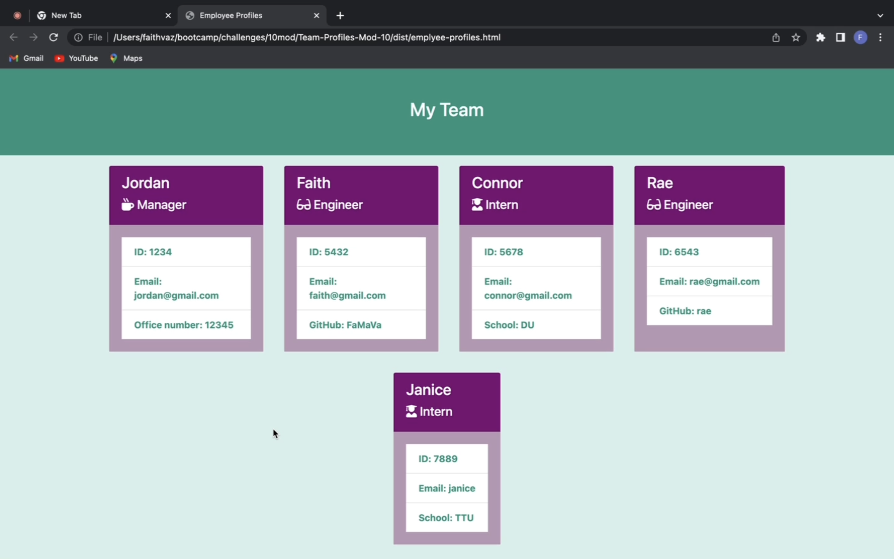

# Team-Profiles-Mod-10

## Description

This application was designed for web development teams to quickly create a HTML webpage that contained profile cards for each member of the project.

## Table of Contents

- [Installation](#installation)
- [Usage](#usage)
- [Credits](#credits)
- [License](#license)

## Installation

- Node.js
- Inquirer NPM Package 
- Jest NPM Package

## Usage

To use this this application, you must first consult the installation section of this README and download the three requirements.  Then, run "node index.js" in your terminal to answer questions for the employee profiles of your team. Once you have created a profile for each of the employees, select "I don't want to add any more team members". Then a HTML file will be generated in the "dist" folder for you to view the profiles on a HTML webpage.

## Credits

N/A

## License

N/A